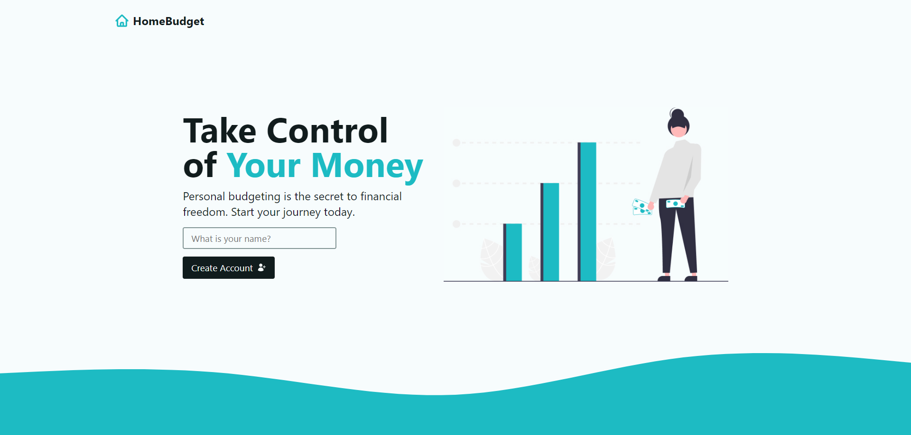
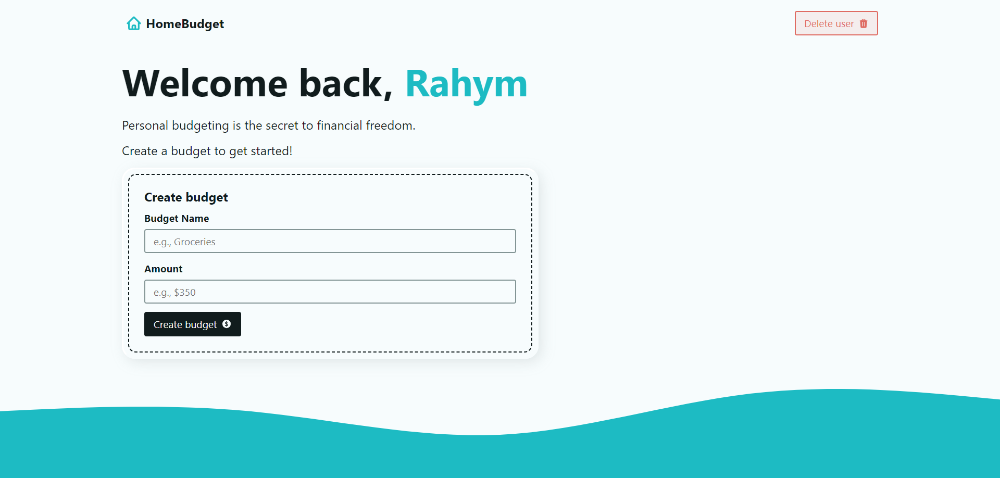
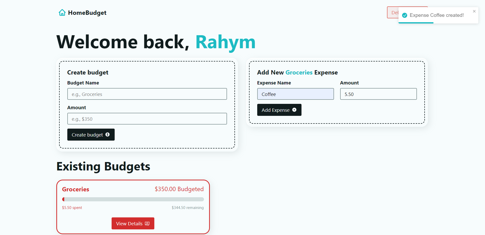
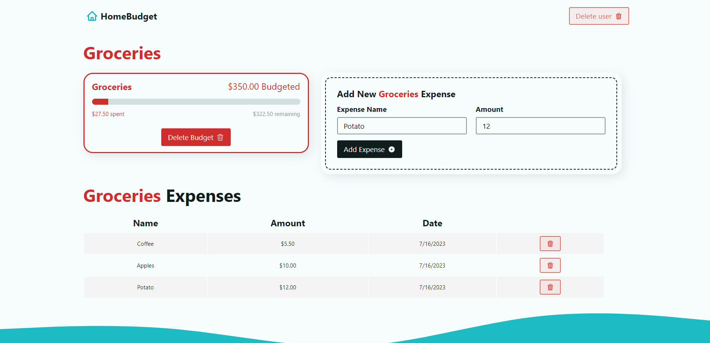

<h1 align="center" id="top">Home Budget React App</h1>

<div align="center" >
&#xa0;
<a href="https://reactrouterbudgetapp.netlify.app">PRODUCTION</a>
</div>

<p align="center">
  
  
  
  
  

</p>

<!-- Status -->

<!-- <h4 align="center">
	🚧  React Router Budget App 🚀 Under construction...  🚧
</h4>

<hr> -->

<p align="center">
  <a href="#dart-about">About</a> &#xa0; | &#xa0; 
  <a href="#sparkles-features">Features</a> &#xa0; | &#xa0;
  <a href="#rocket-technologies">Technologies</a> &#xa0; | &#xa0;
  <a href="#white_check_mark-requirements">Requirements</a> &#xa0; | &#xa0;
  <a href="#checkered_flag-starting">Starting</a> &#xa0; | &#xa0;
  <a href="#memo-screenshots">Screenshots</a> &#xa0; | &#xa0;
  <a href="#memo-contacts">Contacts</a>
</p>

<br>

## :dart: About

It's a small application written on React, to calculate your home budget. Just create your account, name your budget and add expenses. You can control your expenses, see the amount of spent money, and date when you create this expense. You can delete your account whenever you want.

## :sparkles: Features

:heavy_check_mark: Expense Categories: Users can categorize their expenses (e.g., groceries, transportation, entertainment) and provide visual representation of spending by category.\
:heavy_check_mark: Expense Splitting: Users are able to split expenses among multiple categories or budget items to get a more detailed breakdown of their spending.\
:heavy_check_mark: Multiple Budgets: Users have an opportunity to create and manage multiple budgets simultaneously, such as separate budgets for personal and household expenses.

## :rocket: Technologies

The following tools were used in this project:

- [React](https://reactjs.org/)
- [React Router](https://reactrouter.com/en/main)
- [React Toastify](https://fkhadra.github.io/react-toastify/introduction/)

## :white_check_mark: Requirements

Before starting :checkered_flag:, you need to have [Git](https://git-scm.com) and [Node](https://nodejs.org/en/) installed.

## :checkered_flag: Starting

```bash
# Clone this project
$ git clone https://github.com/RahymCharyyev/budget-app.git

# Access
$ cd budget-app

# Install dependencies
$ npm install

# Run the project
$ npm run dev

# The server will initialize in the <http://localhost:3000>
```

## :memo: Screenshots


&#xa0;

&#xa0;

&#xa0;

&#xa0;

&#xa0;

&#xa0;

## :memo: Contacts

&#xa0;
Developed :heart: by <a href="https://github.com/RahymCharyyev" target="_blank">Rahym Charyyev</a>

<a href="#top">Back to top</a>
